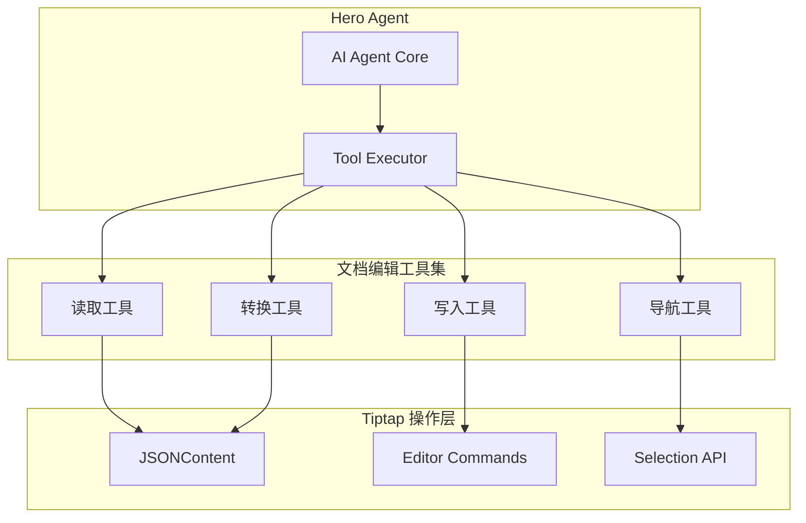

# Vibecape 文档编辑工具设计方案

> 基于 Zed 编辑器的 AI 辅助编辑理念，设计 Vibecape 工作区文档编辑工具

---

## 1. 设计理念

### Zed 编辑器核心模式

| 特性              | Zed 实现                          | Vibecape 适配                     |
| ----------------- | --------------------------------- | --------------------------------- |
| Assistant Panel   | 透明编辑器界面，展示完整 LLM 请求 | 保留 Chat Panel，增加编辑器上下文 |
| Inline Assistant  | 选中文本直接转换                  | **内联 AI 编辑**                  |
| /workflow         | 多步骤工作流修改                  | **工作流命令系统**                |
| Context Awareness | 斜杠命令注入上下文                | **@提及 + 斜杠命令**              |

---

## 2. 工具架构设计



---

## 3. 工具定义

### 3.1 读取工具

#### `getDocumentContent`

```typescript
getDocumentContent: tool({
  description: "获取当前文档的全部内容，返回纯文本格式",
  inputSchema: z.object({}),
  execute: async () => {
    const doc = getCurrentDoc();
    return jsonContentToText(doc.content);
  },
});
```

#### `getDocumentStructure`

```typescript
getDocumentStructure: tool({
  description: "获取文档结构大纲，包含标题层级和段落概要",
  inputSchema: z.object({}),
  execute: async () => {
    const doc = getCurrentDoc();
    return extractOutline(doc.content);
  },
});
```

#### `getSelectedText`

```typescript
getSelectedText: tool({
  description: "获取编辑器中当前选中的文本内容",
  inputSchema: z.object({}),
  execute: async () => {
    const editor = getEditor();
    return editor.state.doc.textBetween(
      editor.state.selection.from,
      editor.state.selection.to
    );
  },
});
```

#### `searchInDocument`

```typescript
searchInDocument: tool({
  description: "在当前文档中搜索文本",
  inputSchema: z.object({
    query: z.string().describe("搜索关键词"),
    caseSensitive: z.boolean().optional(),
  }),
  execute: async ({ query, caseSensitive }) => {
    const doc = getCurrentDoc();
    return findMatches(doc.content, query, caseSensitive);
  },
});
```

---

### 3.2 写入工具

#### `replaceSelection`

```typescript
replaceSelection: tool({
  description: "用新内容替换当前选中的文本",
  inputSchema: z.object({
    content: z.string().describe("替换后的内容"),
  }),
  execute: async ({ content }) => {
    const editor = getEditor();
    editor.chain().focus().deleteSelection().insertContent(content).run();
    return { success: true };
  },
});
```

#### `insertAtCursor`

```typescript
insertAtCursor: tool({
  description: "在光标位置插入内容",
  inputSchema: z.object({
    content: z.string().describe("要插入的内容"),
    position: z.enum(["before", "after"]).optional(),
  }),
  execute: async ({ content, position = "after" }) => {
    const editor = getEditor();
    editor.chain().focus().insertContent(content).run();
    return { success: true };
  },
});
```

#### `appendParagraph`

```typescript
appendParagraph: tool({
  description: "在文档末尾追加新段落",
  inputSchema: z.object({
    content: z.string().describe("段落内容"),
  }),
  execute: async ({ content }) => {
    const editor = getEditor();
    editor
      .chain()
      .focus("end")
      .insertContent([
        { type: "paragraph", content: [{ type: "text", text: content }] },
      ])
      .run();
    return { success: true };
  },
});
```

#### `replaceBySearch`

```typescript
replaceBySearch: tool({
  description: "搜索并替换文档中的文本",
  inputSchema: z.object({
    search: z.string().describe("要搜索的文本"),
    replace: z.string().describe("替换后的文本"),
    all: z.boolean().optional().describe("是否替换全部"),
  }),
  execute: async ({ search, replace, all = false }) => {
    // 实现搜索替换逻辑
    return { replaced: count };
  },
});
```

---

### 3.3 转换工具

#### `polishText`

```typescript
polishText: tool({
  description: "润色选中的文本，使其更流畅、专业",
  inputSchema: z.object({
    style: z.enum(["formal", "casual", "technical"]).optional(),
  }),
  execute: async ({ style = "formal" }) => {
    const text = getSelectedText();
    // 调用 LLM 进行润色
    const polished = await llmPolish(text, style);
    replaceSelection(polished);
    return { original: text, polished };
  },
});
```

#### `expandContent`

```typescript
expandContent: tool({
  description: "扩展选中的内容，增加更多细节和描述",
  inputSchema: z.object({
    direction: z.enum(["detail", "example", "explanation"]).optional(),
  }),
  execute: async ({ direction = "detail" }) => {
    const text = getSelectedText();
    const expanded = await llmExpand(text, direction);
    replaceSelection(expanded);
    return { success: true };
  },
});
```

#### `summarizeContent`

```typescript
summarizeContent: tool({
  description: "总结选中的内容，生成简洁版本",
  inputSchema: z.object({
    maxLength: z.number().optional().describe("目标字数"),
  }),
  execute: async ({ maxLength = 100 }) => {
    const text = getSelectedText();
    const summary = await llmSummarize(text, maxLength);
    return { summary };
  },
});
```

#### `translateText`

```typescript
translateText: tool({
  description: "翻译选中的文本",
  inputSchema: z.object({
    targetLanguage: z.enum(["en", "zh", "ja", "ko"]),
  }),
  execute: async ({ targetLanguage }) => {
    const text = getSelectedText();
    const translated = await llmTranslate(text, targetLanguage);
    replaceSelection(translated);
    return { original: text, translated };
  },
});
```

---

### 3.4 结构工具

#### `insertHeading`

```typescript
insertHeading: tool({
  description: "插入标题",
  inputSchema: z.object({
    level: z.number().min(1).max(6).describe("标题级别 1-6"),
    text: z.string().describe("标题文本"),
  }),
  execute: async ({ level, text }) => {
    const editor = getEditor();
    editor
      .chain()
      .insertContent({
        type: "heading",
        attrs: { level },
        content: [{ type: "text", text }],
      })
      .run();
    return { success: true };
  },
});
```

#### `insertCodeBlock`

```typescript
insertCodeBlock: tool({
  description: "插入代码块",
  inputSchema: z.object({
    language: z.string().describe("编程语言"),
    code: z.string().describe("代码内容"),
  }),
  execute: async ({ language, code }) => {
    const editor = getEditor();
    editor
      .chain()
      .insertContent({
        type: "codeBlock",
        attrs: { language },
        content: [{ type: "text", text: code }],
      })
      .run();
    return { success: true };
  },
});
```

#### `insertList`

```typescript
insertList: tool({
  description: "插入列表",
  inputSchema: z.object({
    type: z.enum(["bullet", "ordered", "task"]),
    items: z.array(z.string()).describe("列表项"),
  }),
  execute: async ({ type, items }) => {
    const listType =
      type === "ordered"
        ? "orderedList"
        : type === "task"
        ? "taskList"
        : "bulletList";
    // 构建列表 JSONContent
    const content = buildListContent(listType, items);
    getEditor().chain().insertContent(content).run();
    return { success: true };
  },
});
```

---

## 4. 工作流系统

### 4.1 Workflow 命令设计

借鉴 Zed 的 `/workflow` 模式：

```typescript
// 用户输入: /workflow 优化文档结构

interface WorkflowStep {
  type: "read" | "think" | "edit" | "confirm";
  description: string;
  tool?: string;
  params?: Record<string, any>;
}

const documentOptimizeWorkflow: WorkflowStep[] = [
  {
    type: "read",
    description: "分析当前文档结构",
    tool: "getDocumentStructure",
  },
  { type: "think", description: "识别可优化的部分" },
  { type: "edit", description: "重组标题层级", tool: "restructureHeadings" },
  { type: "edit", description: "优化段落过渡", tool: "polishTransitions" },
  { type: "confirm", description: "预览更改，等待确认" },
];
```

### 4.2 内置工作流

| 工作流       | 说明     | 步骤                       |
| ------------ | -------- | -------------------------- |
| `/polish`    | 全文润色 | 分析 → 润色 → 展示差异     |
| `/structure` | 优化结构 | 提取大纲 → 建议调整 → 应用 |
| `/expand`    | 内容扩展 | 识别简短部分 → 扩写 → 合并 |
| `/summarize` | 生成摘要 | 全文阅读 → 提取要点 → 生成 |

---

## 5. 实现计划

### Phase 1: 基础工具 (1 周)

- [ ] 实现 `getDocumentContent`
- [ ] 实现 `getSelectedText`
- [ ] 实现 `replaceSelection`
- [ ] 实现 `insertAtCursor`
- [ ] 集成到现有 Hero 系统

### Phase 2: 转换工具 (1 周)

- [ ] 实现 `polishText`
- [ ] 实现 `translateText`
- [ ] 实现 `expandContent`
- [ ] 添加差异预览 UI

### Phase 3: 工作流 (2 周)

- [ ] 设计 Workflow 执行器
- [ ] 实现 `/polish` 工作流
- [ ] 实现 `/structure` 工作流
- [ ] 添加确认/回滚机制

---

## 6. 工具注册示例

```typescript
// heroes/tools/document.ts
import { tool } from "ai";
import { z } from "zod";

export const documentTools = {
  getDocumentContent: tool({...}),
  getSelectedText: tool({...}),
  replaceSelection: tool({...}),
  insertAtCursor: tool({...}),
  polishText: tool({...}),
  translateText: tool({...}),
};

// heroes/presets/muse/index.ts
export const muse = new Hero({
  ...info,
  prompt: { en, zh },
  tools: {
    ...commonTools,
    ...documentTools,  // 文档编辑工具
  },
  maxSteps: 30,
});
```

---

## 7. UI 交互设计

### 7.1 内联编辑触发

```
用户选中文本 → 显示 AI 菜单 → 选择操作 → 执行并预览差异
```

### 7.2 差异预览组件

```tsx
<PolishDiffView
  original={originalText}
  modified={modifiedText}
  onAccept={() => applyChange()}
  onReject={() => revertChange()}
/>
```

### 7.3 工作流进度

```tsx
<WorkflowProgress
  steps={workflow.steps}
  currentStep={2}
  onPause={() => pauseWorkflow()}
  onCancel={() => cancelWorkflow()}
/>
```
